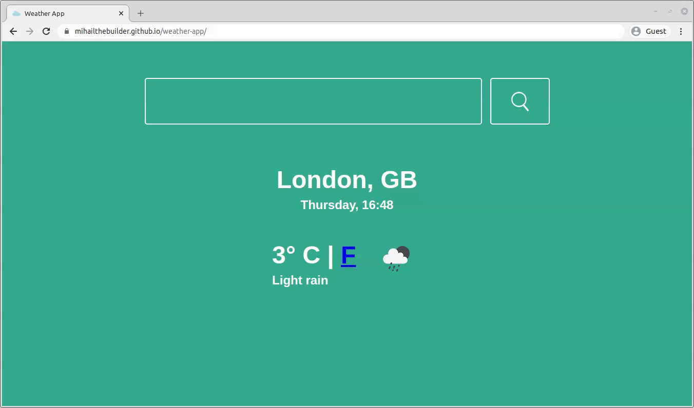
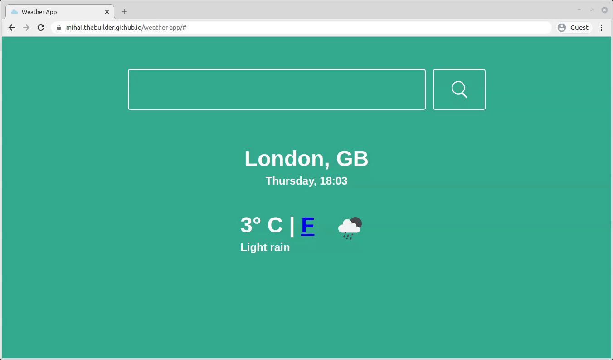

# Weather App

## Overview

A simple web app that displays the current weather in a city input by the user. Made with JavaScript, [Webpack 5](https://webpack.js.org/), [Sass](https://sass-lang.com/) and the [Open Weather Map API](https://openweathermap.org/). See it [live here](https://mihailthebuilder.github.io/weather-app/).

**Update:** Having had another look at the project, I realise that fading effects for the animations might occasionally not work due to the way I set them up. I explain further [here](#sub-optimal-setup).

## Highlights

### Weather API

All the data is generated from the `getWeather` function in [common.js](./src/common/common.js) by using Open Weather Map's [current weather API](https://openweathermap.org/current):

```js
const getWeather = async (location) => {
  try {
    let url = `https://api.openweathermap.org/data/2.5/weather?q=${location}&appid=7986a26ff47f7262c74542709f87e5e7&units=metric`;

    let response = await fetch(url);
    let responseData = await response.json();

    let browserDate = new Date();

    let dateLocal = new Date(
      (responseData.dt +
        responseData.timezone +
        browserDate.getTimezoneOffset() * 60) *
        1000
    );

    let days = [
      "Sunday",
      "Monday",
      "Tuesday",
      "Wednesday",
      "Thursday",
      "Friday",
      "Saturday",
    ];

    let dateString =
      days[dateLocal.getDay()] + ", " + dateLocal.toTimeString().slice(0, 5);

    return {
      city: responseData.name,
      country: responseData.sys.country,
      temperature: responseData.main.temp,
      description: responseData.weather[0].description,
      iconUrl: `https://openweathermap.org/img/wn/${responseData.weather[0].icon}@2x.png`,
      dateTime: dateString,
    };
  } catch (error) {
    return false;
  }
};
```

The `appid` part of the `url` string represents an authentication which I obtained by signing up for a free account with Open Weather Map. Their API requires me to submit such a key in order to retrieve data. **Note:** You shouldn't reveal your API key for security reasons, but I decided to do it for showcasing purposes.

The `units=metric` in the string then specifies that the temperature should be retrieved in metric format. If you don't specify, you'll get values in Kelvin.

`async/await` makes `getWeather` wait for the API request to be completed and for the response to be converted into JSON. I then use the following data points from the response:

- `name` = city name
- `sys.country` = country code
- `main.temp` = temperature in the city
- `weather[0].description` = short description of the weather
- `weather[0].icon` = the id for the weather icon which can then be used to get the URL for the icon in question. [See this](https://openweathermap.org/weather-conditions) for more.
- `dt` = a Unix UTC timestamp for when the data was calculated in the API
- `timezone` = difference in seconds between the UTC time and the time in the city for which the weather data was retrieved. Used together with the value for `dt` to calculate the local date and time in the `dateLocal` variable.

Finally, API request in wrapped in a `try/catch` statement to avoid crashes when there's errors, either because of an incorrect input or because of an API failure.

### Animations

Two animations are present on this website. The first one appears when the page is first loaded:



The background color, search bar and weather data become visible in that exact order using a fading effect. This is controlled in the [index.js](./src/index.js) file by leveraging `async/await`:

```js
const pageLoad = async (location) => {
  //wait for the weather data to be retrieved
  const weatherData = await getWeather(location);

  //update the colour of the background based on the temperature
  await updateBackground(weatherData.temperature);

  //load the search bar
  await loadSearchBar();

  //load the weather table
  loadWeatherTable(weatherData);
};

//when the page is initally loaded, the weather data will be for London, UK
pageLoad("London");
```

There are 5 background color options in the `updateBackground` function, based on ranges of temperature values.

```js
const BACKGROUNDS = [
  {
    min_temp: -99,
    max_temp: -5,
    background_class: "freezing-background",
  },
  {
    min_temp: -5,
    max_temp: 5,
    background_class: "cold-background",
  },
  {
    min_temp: 5,
    max_temp: 16,
    background_class: "neutral-background",
  },
  {
    min_temp: 16,
    max_temp: 23,
    background_class: "warm-background",
  },
  {
    min_temp: 23,
    max_temp: 99,
    background_class: "hot-background",
  },
];
```

```scss
.freezing-background {
  background-color: #264653;
}
.cold-background {
  background-color: #2a9d8f;
}
.neutral-background {
  background-color: #e9c46a;
}
.warm-background {
  background-color: #f4a261;
}
.hot-background {
  background-color: #e76f51;
}
```

The different colors can be seen when loading cities with different temperatures, which is the second animation scenario:


In this case, only the background color and the weather data get re-rendered using a fading effect.

#### Sub-optimal setup

I had another look at the project a while after I initially completed it, and I realised that the way I set up the animations is sub-optimal. There will be some occasions where some components will jump into visibility without the fading effect.

The reason for this is that there is no `Promise` chain linking the completion of the search bar, background color and weather data rendering. Instead, I had placed time delays that cover usual load times for the elements. This becomes clearer when you place the `loadSearchBar` function in [search_bar.js](./src/components/search_bar/search_bar.js) next to `pageLoad` function in [index.js](./src/index.js):

```js
const delay = (ms) => new Promise((res) => setTimeout(res, ms));

const loadSearchBar = async () => {
  document.querySelector("main").insertAdjacentHTML("afterbegin", html);

  //arbitrary time delays that don't take into consideration when the
  //fading effect finishes for making the search bar visible...
  setTimeout(() => {
    document.getElementById("search-bar").className = "visible";
  }, 100);

  await delay(550);
};
const pageLoad = async (location) => {
  const weatherData = await getWeather(location);
  await updateBackground(weatherData.temperature);
  await loadSearchBar();
  //...so loadWeatherTable doesn't actually know whether the
  //search bar has become visible
  loadWeatherTable(weatherData);
};
```

I built a more robust fading animation using `async/await` in [this project](https://github.com/mihailthebuilder/personal-site).

### Celsius / Fahrenheit converter

The temperature measurement which is **not** currently used is wrapped inside a clickable element that, when clicked, converts the temperature to that unit of measurement.



The `convertTemp` function in [weather_table.js](./src/components/weather_table/weather_table.js) does the conversion and re-rendering:

```js
const convertTemp = (clickedElem) => {
  //get the original temperature from what's rendered on the HTML
  let tempElem = document.getElementById("temperature");
  let originalTemp = parseFloat(tempElem.getAttribute("tempValue"));

  //calculate the new temperature
  let newTemp = 0;

  if (clickedElem.innerText == "F") {
    newTemp = (originalTemp * 9) / 5 + 32;
  } else {
    newTemp = ((originalTemp - 32) * 5) / 9;
  }

  tempElem.setAttribute("tempValue", newTemp);
  tempElem.innerText = Math.round(newTemp) + "°";

  //place the attribute conversion trigger on the old unit of measurement
  let newConvertButton = document.querySelector("a:not([href])");
  newConvertButton.setAttribute("href", "#");
  newConvertButton.addEventListener("click", (event) => {
    convertTemp(event.target);
  });

  //remove the trigger for the new element
  let clickedElemReplacement = document.createElement("a");
  clickedElemReplacement.innerText = clickedElem.innerText;
  clickedElem.replaceWith(clickedElemReplacement);
};
```

I felt it would be a better design if I didn't query the Open Weather Map API for a simple temperature conversion.
